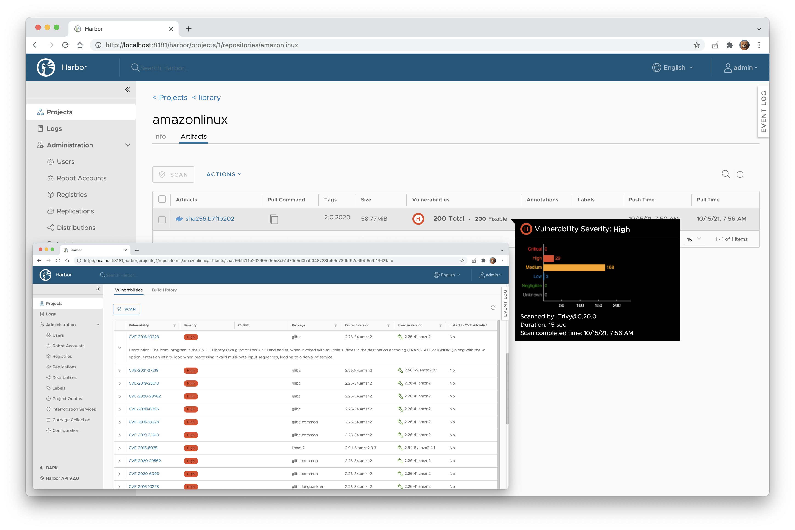
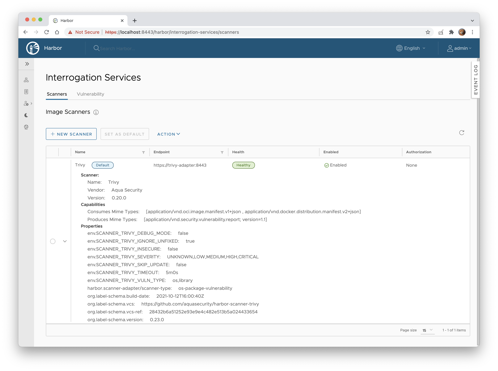

[![GitHub Release][release-img]][release]
[![GitHub Build Actions][build-action-img]][actions]
[![Go Report Card][report-card-img]][report-card]
[![License][license-img]][license]
![Docker Pulls / KhulnaSoft][docker-pulls-khulnasoft]
![Docker Pulls / Harbor][docker-pulls-harbor]

# Harbor Scanner Adapter for Vul

The Harbor [Scanner Adapter][harbor-pluggable-scanners] for [Vul] is a service that translates the [Harbor] scanning
API into Vul commands and allows Harbor to use Vul for providing vulnerability reports on images stored in Harbor
registry as part of its vulnerability scan feature.

Harbor Scanner Adapter for Vul is the default static vulnerability scanner in Harbor >= 2.2.



For compliance with core components Harbor builds the adapter service binaries into Docker images based on Photos OS
(`goharbor/vul-adapter-photon`), whereas in this repository we build Docker images based on Alpine
(`khulnasoft/harbor-scanner-vul`). There is no difference in functionality though.

## TOC

- [Version Matrix](#version-matrix)
- [Deployment](#deployment)
  - [Harbor >= 2.0 on Kubernetes](#harbor--20-on-kubernetes)
  - [Harbor 1.10 on Kubernetes](#harbor-110-on-kubernetes)
- [Configuration](#configuration)
- [Documentation](#documentation)
- [Troubleshooting](#troubleshooting)
- [Contributing](#contributing)

## Version Matrix

The following matrix indicates the version of Vul and Vul adapter installed in each Harbor
[release](https://github.com/goharbor/harbor/releases).

| Harbor           | Vul Adapter | Vul           |
|------------------|---------------|-----------------|
| -                | v0.30.15      | [vul v0.44.0] |
| -                | v0.30.14      | [vul v0.43.0] |
| -                | v0.30.13      | [vul v0.43.0] |
| -                | v0.30.12      | [vul v0.42.0] |
| -                | v0.30.11      | [vul v0.40.0] |
| -                | v0.30.10      | [vul v0.39.0] |
| -                | v0.30.9       | [vul v0.38.2] |
| -                | v0.30.8       | [vul v0.38.2] |
| -                | v0.30.7       | [vul v0.37.2] |
| -                | v0.30.6       | [vul v0.35.0] |
| -                | v0.30.5       | [vul v0.35.0] |
| -                | v0.30.4       | [vul v0.35.0] |
| -                | v0.30.3       | [vul v0.35.0] |
| -                | v0.30.2       | [vul v0.32.1] |
| -                | v0.30.0       | [vul v0.29.2] |
| -                | v0.29.0       | [vul v0.28.1] |
| [harbor v2.5.1]  | v0.28.0       | [vul v0.26.0] |
| -                | v0.27.0       | [vul v0.25.0] |
| [harbor v2.5.0]  | v0.26.0       | [vul v0.24.2] |
| -                | v0.25.0       | [vul v0.22.0] |
| [harbor v2.4.1]  | v0.24.0       | [vul v0.20.1] |
| [harbor v2.4.0]  | v0.24.0       | [vul v0.20.1] |
| -                | v0.23.0       | [vul v0.20.0] |
| -                | v0.22.0       | [vul v0.19.2] |
| -                | v0.21.0       | [vul v0.19.2] |
| -                | v0.20.0       | [vul v0.18.3] |
| [harbor v2.3.3]  | v0.19.0       | [vul v0.17.2] |
| [harbor v2.3.0]  | v0.19.0       | [vul v0.17.2] |
| [harbor v2.2.3]  | v0.18.0       | [vul v0.16.0] |
| [harbor v2.2.0]  | v0.18.0       | [vul v0.16.0] |
| [harbor v2.1.6]  | v0.14.1       | [vul v0.9.2]  |
| [harbor v2.1.0]  | v0.14.1       | [vul v0.9.2]  |

[harbor v2.5.1]: https://github.com/goharbor/harbor/releases/tag/v2.5.1
[harbor v2.5.0]: https://github.com/goharbor/harbor/releases/tag/v2.5.0
[harbor v2.4.1]: https://github.com/goharbor/harbor/releases/tag/v2.4.1
[harbor v2.4.0]: https://github.com/goharbor/harbor/releases/tag/v2.4.0
[harbor v2.3.3]: https://github.com/goharbor/harbor/releases/tag/v2.3.3
[harbor v2.3.0]: https://github.com/goharbor/harbor/releases/tag/v2.3.0
[harbor v2.2.3]: https://github.com/goharbor/harbor/releases/tag/v2.2.3
[harbor v2.2.0]: https://github.com/goharbor/harbor/releases/tag/v2.2.0
[harbor v2.1.6]: https://github.com/goharbor/harbor/releases/tag/v2.1.6
[harbor v2.1.0]: https://github.com/goharbor/harbor/releases/tag/v2.1.0

[vul v0.44.0]: https://github.com/khulnasoft-lab/vul/releases/tag/v0.44.0
[vul v0.43.0]: https://github.com/khulnasoft-lab/vul/releases/tag/v0.43.0
[vul v0.42.0]: https://github.com/khulnasoft-lab/vul/releases/tag/v0.42.0
[vul v0.40.0]: https://github.com/khulnasoft-lab/vul/releases/tag/v0.40.0
[vul v0.39.0]: https://github.com/khulnasoft-lab/vul/releases/tag/v0.39.0
[vul v0.38.2]: https://github.com/khulnasoft-lab/vul/releases/tag/v0.38.2
[vul v0.37.2]: https://github.com/khulnasoft-lab/vul/releases/tag/v0.37.2
[vul v0.35.0]: https://github.com/khulnasoft-lab/vul/releases/tag/v0.35.0
[vul v0.32.1]: https://github.com/khulnasoft-lab/vul/releases/tag/v0.32.1
[vul v0.29.2]: https://github.com/khulnasoft-lab/vul/releases/tag/v0.29.2
[vul v0.28.1]: https://github.com/khulnasoft-lab/vul/releases/tag/v0.28.1
[vul v0.26.0]: https://github.com/khulnasoft-lab/vul/releases/tag/v0.26.0
[vul v0.25.0]: https://github.com/khulnasoft-lab/vul/releases/tag/v0.25.0
[vul v0.24.2]: https://github.com/khulnasoft-lab/vul/releases/tag/v0.24.2
[vul v0.22.0]: https://github.com/khulnasoft-lab/vul/releases/tag/v0.22.0
[vul v0.20.1]: https://github.com/khulnasoft-lab/vul/releases/tag/v0.20.1
[vul v0.20.0]: https://github.com/khulnasoft-lab/vul/releases/tag/v0.20.0
[vul v0.19.2]: https://github.com/khulnasoft-lab/vul/releases/tag/v0.19.2
[vul v0.18.3]: https://github.com/khulnasoft-lab/vul/releases/tag/v0.18.3
[vul v0.17.2]: https://github.com/khulnasoft-lab/vul/releases/tag/v0.17.2
[vul v0.16.0]: https://github.com/khulnasoft-lab/vul/releases/tag/v0.16.0
[vul v0.9.2]: https://github.com/khulnasoft-lab/vul/releases/tag/v0.9.2

## Deployment

### Harbor >= 2.0 on Kubernetes

In Harbor >= 2.0 Vul can be configured as the default vulnerability scanner, therefore you can install it with the
official [Harbor Helm chart], where `HARBOR_CHART_VERSION` >= 1.4:

```
helm repo add harbor https://helm.goharbor.io
```

```
helm install harbor harbor/harbor \
  --create-namespace \
  --namespace harbor \
  --set clair.enabled=false \
  --set vul.enabled=true
```

The adapter service is automatically registered under the **Interrogation Service** in the Harbor interface and
designated as the default scanner.

### Harbor 1.10 on Kubernetes

1. Install the `harbor-scanner-vul` chart:

   ```
   helm repo add khulnasoft https://khulnasoft-lab.github.io/helm-charts
   ```

   ```
   helm install harbor-scanner-vul khulnasoft/harbor-scanner-vul \
     --namespace harbor --create-namespace
   ```

2. Configure the scanner adapter in the Harbor interface.
   1. Navigate to **Interrogation Services** and click **+ NEW SCANNER**.
      
   2. Enter <http://harbor-scanner-vul.harbor:8080> as the **Endpoint** URL and click **TEST CONNECTION**.
      
   3. If everything is fine click **ADD** to save the configuration.
3. Select the **Vul** scanner and set it as default by clicking **SET AS DEFAULT**.
   
   Make sure the **Default** label is displayed next to the **Vul** scanner's name.

## Configuration

Configuration of the adapter is done via environment variables at startup.

| Name                                    | Default                            | Description                                                                                                                                                                                                                                                                        |
|-----------------------------------------|------------------------------------|------------------------------------------------------------------------------------------------------------------------------------------------------------------------------------------------------------------------------------------------------------------------------------|
| `SCANNER_LOG_LEVEL`                     | `info`                             | The log level of `trace`, `debug`, `info`, `warn`, `warning`, `error`, `fatal` or `panic`. The standard logger logs entries with that level or anything above it.                                                                                                                  |
| `SCANNER_API_SERVER_ADDR`               | `:8080`                            | Binding address for the API server                                                                                                                                                                                                                                                 |
| `SCANNER_API_SERVER_TLS_CERTIFICATE`    | N/A                                | The absolute path to the x509 certificate file                                                                                                                                                                                                                                     |
| `SCANNER_API_SERVER_TLS_KEY`            | N/A                                | The absolute path to the x509 private key file                                                                                                                                                                                                                                     |
| `SCANNER_API_SERVER_CLIENT_CAS`         | N/A                                | A list of absolute paths to x509 root certificate authorities that the api use if required to verify a client certificate                                                                                                                                                          |
| `SCANNER_API_SERVER_READ_TIMEOUT`       | `15s`                              | The maximum duration for reading the entire request, including the body                                                                                                                                                                                                            |
| `SCANNER_API_SERVER_WRITE_TIMEOUT`      | `15s`                              | The maximum duration before timing out writes of the response                                                                                                                                                                                                                      |
| `SCANNER_API_SERVER_IDLE_TIMEOUT`       | `60s`                              | The maximum amount of time to wait for the next request when keep-alives are enabled                                                                                                                                                                                               |
| `SCANNER_VUL_CACHE_DIR`               | `/home/scanner/.cache/vul`       | Vul cache directory                                                                                                                                                                                                                                                              |
| `SCANNER_VUL_REPORTS_DIR`             | `/home/scanner/.cache/reports`     | Vul reports directory                                                                                                                                                                                                                                                            |
| `SCANNER_VUL_DEBUG_MODE`              | `false`                            | The flag to enable or disable Vul debug mode                                                                                                                                                                                                                                     |
| `SCANNER_VUL_VULN_TYPE`               | `os,library`                       | Comma-separated list of vulnerability types. Possible values are `os` and `library`.                                                                                                                                                                                               |
| `SCANNER_VUL_SECURITY_CHECKS`         | `vuln,config,secret`               | comma-separated list of what security issues to detect. Possible values are `vuln`, `config` and `secret`. Defaults to `vuln`.                                                                                                                                                     |
| `SCANNER_VUL_SEVERITY`                | `UNKNOWN,LOW,MEDIUM,HIGH,CRITICAL` | Comma-separated list of vulnerabilities severities to be displayed                                                                                                                                                                                                                 |
| `SCANNER_VUL_IGNORE_UNFIXED`          | `false`                            | The flag to display only fixed vulnerabilities                                                                                                                                                                                                                                     |
| `SCANNER_VUL_IGNORE_POLICY`           | ``                                 | The path for the Vul ignore policy OPA Rego file                                                                                                                                                                                                                                 |
| `SCANNER_VUL_SKIP_UPDATE`             | `false`                            | The flag to disable [Vul DB] downloads.                                                                                                                                                                                                                                          |
| `SCANNER_VUL_OFFLINE_SCAN`            | `false`                            | The flag to disable external API requests to identify dependencies.                                                                                                                                                                                                                |
| `SCANNER_VUL_GITHUB_TOKEN`            | N/A                                | The GitHub access token to download [Vul DB] (see [GitHub rate limiting][gh-rate-limit])                                                                                                                                                                                         |
| `SCANNER_VUL_INSECURE`                | `false`                            | The flag to skip verifying registry certificate                                                                                                                                                                                                                                    |
| `SCANNER_VUL_TIMEOUT`                 | `5m0s`                             | The duration to wait for scan completion                                                                                                                                                                                                                                           |
| `SCANNER_STORE_REDIS_NAMESPACE`         | `harbor.scanner.vul:store`       | The namespace for keys in the Redis store                                                                                                                                                                                                                                          |
| `SCANNER_STORE_REDIS_SCAN_JOB_TTL`      | `1h`                               | The time to live for persisting scan jobs and associated scan reports                                                                                                                                                                                                              |
| `SCANNER_JOB_QUEUE_REDIS_NAMESPACE`     | `harbor.scanner.vul:job-queue`   | The namespace for keys in the scan jobs queue backed by Redis                                                                                                                                                                                                                      |
| `SCANNER_JOB_QUEUE_WORKER_CONCURRENCY`  | `1`                                | The number of workers to spin-up for the scan jobs queue                                                                                                                                                                                                                           |
| `SCANNER_REDIS_URL`                     | `redis://harbor-harbor-redis:6379` | The Redis server URI. The URI supports schemas to connect to a standalone Redis server, i.e. `redis://:password@standalone_host:port/db-number` and Redis Sentinel deployment, i.e. `redis+sentinel://:password@sentinel_host1:port1,sentinel_host2:port2/monitor-name/db-number`. |
| `SCANNER_REDIS_POOL_MAX_ACTIVE`         | `5`                                | The max number of connections allocated by the Redis connection pool                                                                                                                                                                                                               |
| `SCANNER_REDIS_POOL_MAX_IDLE`           | `5`                                | The max number of idle connections in the Redis connection pool                                                                                                                                                                                                                    |
| `SCANNER_REDIS_POOL_IDLE_TIMEOUT`       | `5m`                               | The duration after which idle connections to the Redis server are closed. If the value is zero, then idle connections are not closed.                                                                                                                                              |
| `SCANNER_REDIS_POOL_CONNECTION_TIMEOUT` | `1s`                               | The timeout for connecting to the Redis server                                                                                                                                                                                                                                     |
| `SCANNER_REDIS_POOL_READ_TIMEOUT`       | `1s`                               | The timeout for reading a single Redis command reply                                                                                                                                                                                                                               |
| `SCANNER_REDIS_POOL_WRITE_TIMEOUT`      | `1s`                               | The timeout for writing a single Redis command.                                                                                                                                                                                                                                    |
| `HTTP_PROXY`                            | N/A                                | The URL of the HTTP proxy server                                                                                                                                                                                                                                                   |
| `HTTPS_PROXY`                           | N/A                                | The URL of the HTTPS proxy server                                                                                                                                                                                                                                                  |
| `NO_PROXY`                              | N/A                                | The URLs that the proxy settings do not apply to                                                                                                                                                                                                                                   |

## Documentation

- [Architecture](./docs/ARCHITECTURE.md) - architectural decisions behind designing harbor-scanner-vul.
- [Releases](./docs/RELEASES.md) - how to release a new version of harbor-scanner-vul.

## Troubleshooting

### Error: database error: --skip-db-update cannot be specified on the first run

If you set the value of the `SCANNER_VUL_SKIP_UPDATE` to `true`, make sure that you download the [Vul DB]
and mount it in the `/home/scanner/.cache/vul/db/vul.db` path.

### Error: failed to list releases: Get <https://api.github.com/repos/khulnasoft-lab/vul-db/releases>: dial tcp: lookup api.github.com on 127.0.0.11:53: read udp 127.0.0.1:39070->127.0.0.11:53: i/o timeout

Most likely it's a Docker DNS server or network firewall configuration issue. Vul requires internet connection to
periodically download vulnerability database from GitHub to show up-to-date risks.

Try adding a DNS server to `docker-compose.yml` created by Harbor installer.

```yaml
version: 2
services:
  vul-adapter:
    # NOTE Adjust IPs to your environment.
    dns:
      - 8.8.8.8
      - 192.168.1.1
```

Alternatively, configure Docker daemon to use the same DNS server as host operating system. See [DNS services][docker-dns]
section in the Docker container networking documentation for more details.

### Error: failed to list releases: GET <https://api.github.com/repos/khulnasoft-lab/vul-db/releases>: 403 API rate limit exceeded

Vul DB downloads from GitHub are subject to [rate limiting][gh-rate-limit]. Make sure that the Vul DB is mounted
and cached in the `/home/scanner/.cache/vul/db/vul.db` path. If, for any reason, it's not enough you can set the
value of the `SCANNER_VUL_GITHUB_TOKEN` environment variable (authenticated requests get a higher rate limit).

## Contributing

Please read [CONTRIBUTING.md](CONTRIBUTING.md) for details on our code of conduct, and the process for submitting pull
requests.

---
Harbor Scanner Adapter for Vul is an [KhulnaSoft Security](https://khulnasoft.com) open source project.  
Learn about our open source work and portfolio [here](https://www.khulnasoft.com/products/open-source-projects/).

[release-img]: https://img.shields.io/github/release/khulnasoft-lab/harbor-scanner-vul.svg?logo=github
[release]: https://github.com/khulnasoft-lab/harbor-scanner-vul/releases
[build-action-img]: https://github.com/khulnasoft-lab/harbor-scanner-vul/workflows/build/badge.svg
[actions]: https://github.com/khulnasoft-lab/harbor-scanner-vul/actions
[report-card-img]: https://goreportcard.com/badge/github.com/khulnasoft-lab/harbor-scanner-vul
[report-card]: https://goreportcard.com/report/github.com/khulnasoft-lab/harbor-scanner-vul
[docker-pulls-khulnasoft]: https://img.shields.io/docker/pulls/khulnasoft/harbor-scanner-vul?logo=docker&label=docker%20pulls%20%2F%20khulnasoft
[docker-pulls-harbor]: https://img.shields.io/docker/pulls/goharbor/vul-adapter-photon?logo=docker&label=docker%20pulls%20%2F%20goharbor
[license-img]: https://img.shields.io/github/license/khulnasoft-lab/harbor-scanner-vul.svg
[license]: https://github.com/khulnasoft-lab/harbor-scanner-vul/blob/main/LICENSE

[Harbor]: https://github.com/goharbor/harbor
[Harbor Helm chart]: https://github.com/goharbor/harbor-helm
[Vul]: https://github.com/khulnasoft-lab/vul
[Vul DB]: https://github.com/khulnasoft-lab/vul-db
[harbor-pluggable-scanners]: https://github.com/goharbor/community/blob/master/proposals/pluggable-image-vulnerability-scanning_proposal.md
[gh-rate-limit]: https://github.com/khulnasoft-lab/vul#github-rate-limiting
[docker-dns]: https://docs.docker.com/config/containers/container-networking/#dns-services
